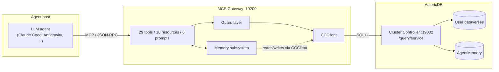
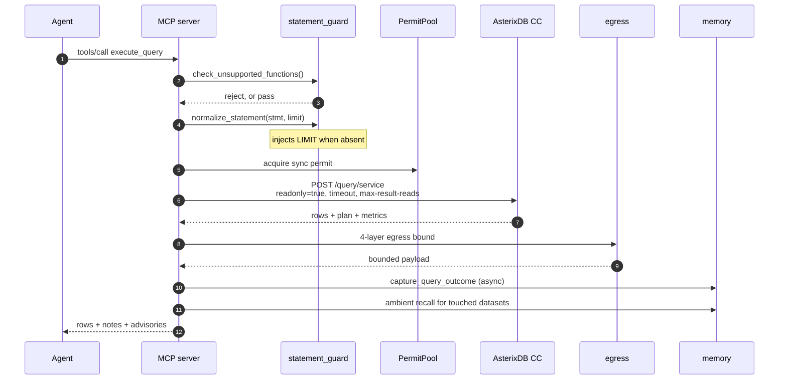
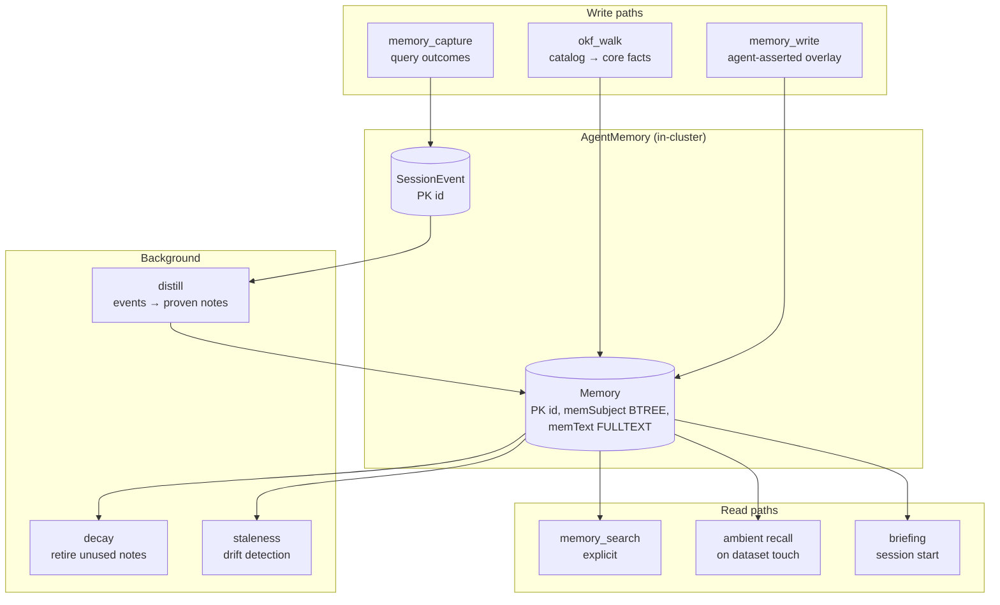
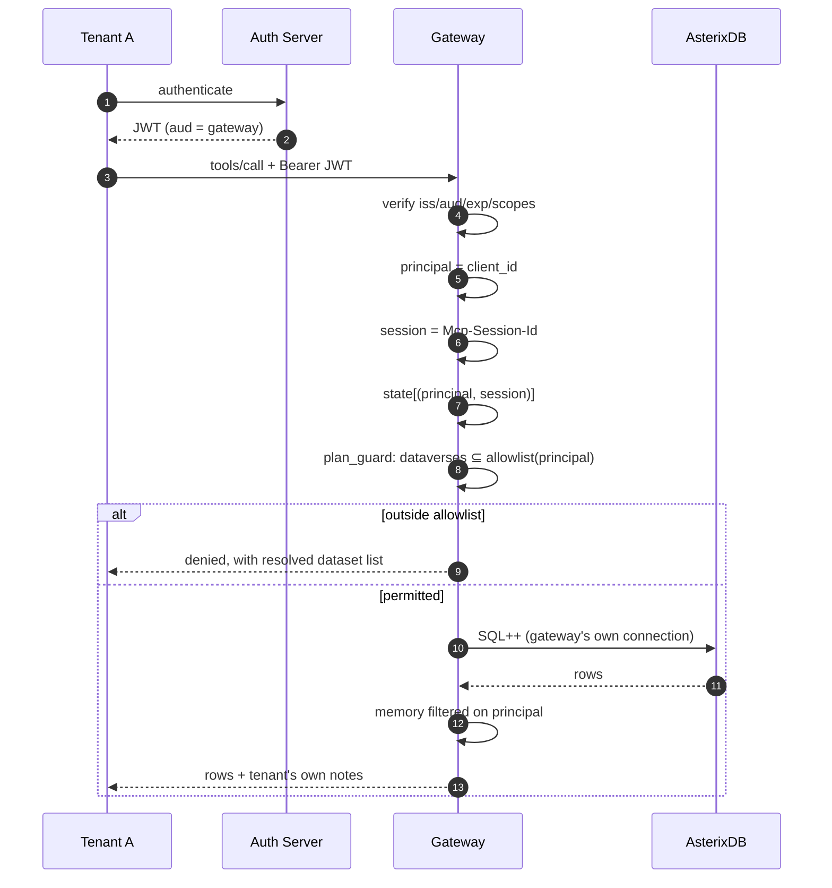
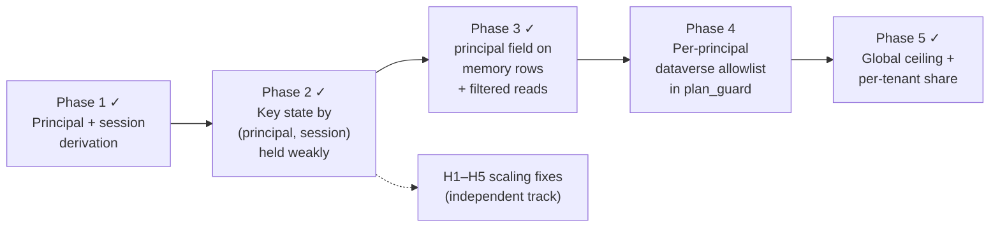

# AsterixDB MCP Gateway — Architecture, Multi-Tenancy, and Token Economics

**Date:** 2026-07-31
**Audience:** AsterixDB dev team
**Purpose:** current state, the multi-tenancy gap, and what we can close without touching engine code.

---

## 1. TL;DR

The gateway is an MCP server that lets an LLM agent query AsterixDB safely. It is
built, tested, and running. Three things are worth the team's time today:

1. **The threat model is the autonomous agent, not the human user.** Human access
   to the CC on 19002 is unchanged and out of scope; engine-level authorization is
   not what this is. The gateway is a parallel, AI-only path that verifies OAuth 2.1
   JWTs, isolates tenants, and caps what an agent can consume ([§5.1](#51-threat-model)).
2. **Three of the four tenancy planes are now closed, on the gateway side alone.**
   Identity, per-connection state, and memory data all carry the caller's principal;
   only cluster-level scoping (Phase 4) and per-tenant quotas (Phase 5) remain. The
   MCP specification's own authorization model puts tenancy at the server, not the
   database, so this needed **no engine changes**. It does need one deployment
   guarantee: an agent's network must not reach 19002 directly.
3. **Memory saves tokens, not correctness.** Measured: −29.4% input tokens. The
   saving comes almost entirely from *fewer turns*, not smaller turns. This changes
   what we should optimize next.

Questions for the team are in [§9](#9-open-questions-for-the-team).

---

## 2. What the gateway is

An LLM agent cannot safely be handed a database. It will write unbounded scans,
pull result sets far larger than its context, hallucinate schema, and repeat the
same failed query across sessions.

The gateway sits between them: it exposes AsterixDB as a set of typed MCP tools,
enforces read-only and resource bounds on every statement, bounds every response
to a token budget, and remembers what worked.

| | |
|---|---|
| Language | Python 3.12, `mcp` SDK 2.x |
| Size | 13,261 lines, 75 test modules, 100% coverage gate |
| Surface | 29 tools, 18 resources, 6 prompts |
| Transports | stdio (one process per client), Streamable HTTP (`:19200`) |
| Cluster contact | AsterixDB CC query service, HTTP |

---

## 3. Current architecture

### 3.1 System context



Note the shape that matters later: **memory lives inside the same cluster as the
data it describes.** That is deliberate — it is what lets a stored fact re-derive
itself by re-running its own `source_query`. Bolt-on memory frameworks keep memory
in a separate store and structurally cannot do this.

### 3.2 Request pipeline — `execute_query` end to end



**Egress is four independent layers** — each one alone is insufficient:

| Layer | Where | Bound |
|---|---|---|
| 1 | CC request params | `readonly=true`, statement timeout, max result reads |
| 2 | `enforce_byte_ceiling` | raw HTTP body cap before parsing |
| 3 | `bound_rows_for_llm` | rows + bytes actually shown to the model |
| 4 | `clamp_long_values` | per-field character clamp |

Plus an adaptive tightening: if the plan shows a **columnar full scan**, layers 3–4
drop to `COLUMNAR_FLAGGED_MAX_ROWS = 10` / `16 KiB` (`egress.py:43-49`).

### 3.3 Memory subsystem



Two design properties worth stating explicitly:

- **Core / overlay split.** The catalog walk owns machine-derived `core` facts and
  rewrites them on every re-walk. Agent-learned `overlay` survives re-walks and is
  re-grounded against the new core.
- **Bi-temporal validity.** Rows carry `valid_from` / `valid_to`. Superseding a fact
  re-inserts and retires; it does not delete. `valid_to IS UNKNOWN` selects current
  rows. This is how a corrected fact and the stale one it replaced stay
  distinguishable — and it is why vector similarity cannot do this job (see
  `docs/design/OKF_VECTOR_MEMORY_RESEARCH.md`).

---

## 4. What's new in MCP 2.0, and how we use it

The gateway migrated to SDK 2.x. The relevant changes:

| Change | How we use it |
|---|---|
| **OAuth 2.1 resource-server model** | `auth.py` verifies bearer JWTs against the AS's JWKS: issuer, audience (RFC 8707), expiry, scopes. Gateway never issues or stores tokens. |
| **Per-call `Context` injection** | No ambient `get_context()`. Every tool takes `ctx` explicitly — identity belongs to the *call*, not the process. This is what makes per-tenant state possible at all. |
| **Session ↔ credential binding** | SDK tracks `_session_owners: dict[str, AuthorizationContext]`; a session can only be used by the credential that created it. Cross-tenant session hijacking is blocked at transport level, free. |
| **`session_idle_timeout`** | Idle sessions reaped automatically. Set to `1800`; it is what releases a connection's scoped state, so it is load-bearing rather than housekeeping. |
| **`version` in `serverInfo`** | Clients can distinguish gateway builds. |
| **Structured tool output** | Tools return typed structured content alongside text; the model gets a schema, not prose. |
| **Transport security settings** | Host binding + DNS-rebinding allowlist as transport args (`build_transport_security`). |

The specification is also explicit about two anti-patterns we must not adopt:

- **Token passthrough is forbidden.** The gateway must not forward the client's
  token upstream to AsterixDB. It holds its own relationship to the cluster.
- **The confused-deputy problem is named directly.** A server that authenticates a
  caller and then acts with its own higher privilege, without scoping to that
  caller, is the exact failure mode.

The second one is our current state. Which brings us to the gap.

---

## 5. Threat model and the multi-tenancy gap

### 5.1 Threat model

Scoping this precisely matters, because the gateway is often read as an attempt to
retrofit security onto an engine that has none. It is not.

**What we are not solving.** AsterixDB has no native authentication or
authorization, and closing that is a project-level decision with a permanent public
API attached. Human users — engineers, BI tools, existing pipelines — keep
connecting to the CC directly on 19002 across a trusted internal boundary. That
access path is unchanged and out of scope here. We are not building a human
authorization layer, and nothing in this document should be read as one.

**What we are solving.** The gateway exists to proxy *AI* traffic safely, on a path
parallel to human access. The threat is not a malicious human; it is the ordinary
behaviour of an autonomous LLM agent: non-deterministic, occasionally
catastrophically wrong about scale, and — uniquely — steerable by the data it
reads. Prompt injection is not an edge case here. Query results are attacker-
influenced input that the model treats as instructions, so every control below is
containment for an agent that has been successfully talked into something.

| Actor | Trust | Path | In scope |
|---|---|---|---|
| Human engineer, BI tool | Trusted | Direct to CC :19002 | No |
| AI agent (model + MCP client) | Semi-trusted, holds an OAuth 2.1 JWT | Through the gateway | **Yes** |
| Data the agent reads | Untrusted | Returned rows the model may obey | **Yes** |

**Assets:** cluster data (confidentiality), cluster compute and availability, and
the memory store — which is both an asset and an attack surface, since it is the
one thing an agent can durably write.

The agent failure modes we accept responsibility for, and what answers each:

| # | Failure mode | Control | Status |
|---|---|---|---|
| T1 | Runaway scan or loop exhausts the cluster | `readonly=true` + CC `timeout` + row/byte egress caps + concurrency permits + a byte budget on the offline event buffer | Built |
| T2 | Agent mutates data | `readonly=true` hardcoded on every `/query/service` call; the sole exception is the memory path, gated to `AgentMemory.*` by statement prefix and to exact-match bootstrap DDL | Built |
| T3 | One tenant's notes reach another tenant | `principal` on every row, predicate on every read, both enforced in the client with build-failing tests (§5.2) | Built |
| T4 | One tenant's *statement text* reaches another via shared in-process state | Per-connection scoping of capture, recall, briefing | Built |
| T5 | Agent reads a dataverse outside its remit | Per-principal allowlist enforced on the compiled plan | **Phase 4** |
| T6 | One tenant starves the others | Two-level permits: a global ceiling the cluster can take, plus a per-tenant share of it | Built |
| T7 | Agent writes a false note a later session trusts | Provenance (`author`, `source_query`), bi-temporal history, decay, staleness detection | Partial — detection works, correction does not (§7) |

T7 is worth naming explicitly because isolation does *not* address it: a poisoned
note stays inside the tenant that wrote it, which is precisely where it does damage.

**What "rate limits" means today, stated honestly.** The gateway caps rows, bytes,
wall-clock per query, and concurrent queries. It does not cap requests per unit
time, and the concurrency pools are shared process-wide rather than per principal.
So T1 is bounded for any single agent, and T6 is not bounded at all. That is the
substance of Phase 5, not a footnote to it.

### 5.2 Where the gap was, and what is now closed

The original finding was that the gateway verified who you are and then threw it
away: `grep get_access_token src/` returned zero hits outside `auth.py`. Four planes
were affected; three are now closed.

```mermaid
flowchart TB
    subgraph P1["Plane 1 — Identity (closed)"]
        I1["auth.py verifies JWT ✓"]
        I2["AccessToken(client_id, scopes) ✓"]
        I3["identity.py reads it per call ✓"]
        I1 --> I2 --> I3
    end

    subgraph P2["Plane 2 — In-process state (closed)"]
        S1["CaptureState, RecallState,<br/>BriefingState"]
        S2["Documented 'session-scoped'"]
        S3["Now one bundle per connection,<br/>held weakly ✓"]
        S1 --> S2 --> S3
    end

    subgraph P3["Plane 3 — Memory data (closed)"]
        D1["AgentMemory.Memory<br/>PRIMARY KEY id"]
        D2["principal on every row,<br/>predicate on every read ✓"]
        D1 --> D2
    end

    subgraph P4["Plane 4 — Cluster authorization (open)"]
        A1["cc_client._headers()<br/>= {Accept: application/json}"]
        A2["No credential. Engine has no authz. ✗"]
        A1 --> A2
    end
```



**Plane 2 detail — this one wrote wrong data (T4).** `CaptureState._failures` was
keyed by *subject only*. The capture rule is "a failure, then a later success on the
same subject, means the second statement fixed the first." Process-wide, with two
concurrent clients, that paired **client A's failure with client B's unrelated
success** and persisted a note asserting B's query fixes A's error. Automatic, no
model involved, then served to everyone — a cross-tenant information path in which
A's statement text lands in a note shown to B.

Two further consequences of the same root cause: only the **first** client ever to
connect received a briefing, and the **second client onward silently received no
memory notes at all** — which defeated the memory layer for every client except one,
in the transport we actually deploy.

All three now exist as named regression tests rather than as prose. The one that
matters most is `test_one_clients_failure_is_never_paired_with_anothers_success`.

**Plane 4 detail.** We verified the engine side:

```
grep -rl 'IAuthenticator|Principal|authenticat' --include='*.java' \
  asterixdb/asterix-app/src/main/java asterixdb/asterix-common/src/main/java
→ CloudProperties.java   (S3 storage credentials — unrelated)

grep -rl 'Authorization' --include='*.java' hyracks-http/src/main/java
→ (no matches)
```

AsterixDB has no authentication or authorization subsystem. Every caller reaching
the CC has full cluster privileges.

This is a statement of fact, not a complaint: per §5.1 it is deliberately out of
scope, and human access continues to depend on the network boundary exactly as it
does today. It has one consequence for us, and it is the reason §5.3's network
policy is a requirement rather than a suggestion — the gateway cannot fall back on
the engine to catch anything it lets through.

### 5.3 Why this belongs in the gateway

Not a workaround — it is the specification's intended shape. MCP defines the server
as an OAuth 2.1 **resource server** that holds its own upstream relationship. The
same pattern is standard elsewhere: PgBouncer, Hasura, PostgREST.

It rests on one deployment guarantee, and the guarantee is narrower than it first
looks — which is what makes it deployable alongside existing human access:

> **The gateway must be the only route from an AI agent to the CC.** Not the only
> route to the CC. Human engineers and BI tools keep their direct connection on
> 19002; what has to be true is that the network the agent runs in cannot reach
> 19002 itself.

Stated as a network policy: agent egress is allowed to the gateway port and denied
to 19002. If that is violated, every control in this document is decoration — an
agent that opens its own connection to the CC has full cluster privileges, because
the engine has no authorization to fall back on. This is a hard requirement, not a
recommendation, and should be documented as such.

### 5.4 The design, as built

Two keys, not one. Conflating them re-breaks things:

| Key | Source | Lifetime | Gates |
|---|---|---|---|
| **principal** (tenant) | `get_access_token().client_id` — verified token only | Spans sessions | Memory rows, dataverse allowlist, quotas |
| **session** | SDK session id | One conversation | Briefing, recall, capture |

Tenant alone re-breaks briefing/recall for the same user's second conversation.
Session alone leaves memory rows shared across tenants.

**Client-supplied headers are never an identity assertion.** The SDK's own docstring
says so. `Mcp-Session-Id` keys state; it never grants authorization.



**Enforce scope in `plan_guard`, not `statement_guard`.** `plan_guard` sees the
datasets the compiled plan *actually* touches, so views, subqueries, and synonyms
cannot smuggle past a regex on statement text.

### 5.5 What the SDK does *not* give us

1. **No session-end callback.** The SDK reaps its own transport and forgets, so
   per-session state keyed by session id would accumulate forever. *Resolved:*
   scopes are held in a `WeakKeyDictionary` against the SDK's own session object,
   so a finished connection releases its state with no TTL, no LRU, and no sweep.
   The eviction policy is the garbage collector.
2. **`session_idle_timeout` was unset.** The SDK's factory takes no argument for
   it, and the default is `None` = never reaped. *Resolved:* it is now set on the
   session manager the factory returns, defaulting to the SDK's recommended
   `1800`. This is what makes item 1 real — weak references release a scope when
   the SDK drops the session, and without a deadline the SDK never drops it, so
   an abandoned connection would pin its state for the life of the process.

---

## 6. Token economics

### 6.1 Measured

Real per-turn token counts, memory-on vs memory-off, identical task sets:

| Metric | Result |
|---|---|
| Input tokens | **−29.4%** (4.30M / 67 turns vs 6.09M / 73 turns) |
| Share of input that is cache-read | 93% |
| Uncached input per turn | only −6% |
| Correctness (Set B) | **10/10 in all three arms** |
| Break-even | ~1.3 sessions |

### 6.2 The conclusion that matters

**Memory sells tokens, not correctness.** Both memory arms and the control arm
scored identically on correctness; both SQL errors observed came *from* memory arms.
We should stop claiming accuracy gains — the honest pitch is cost.

**And the saving is turn elimination, not turn compression.** Per-turn input barely
moved (−6% uncached). Input cost is roughly

```
input ≈ turns × accumulated_context
```

which is superlinear in turns. Removing a turn removes that turn *and* its
contribution to every later turn's context. That is the only superlinear lever we
have — everything else is a constant factor.

### 6.3 Where the remaining budget goes

The 29 tool schemas cost **~12.9k tokens per turn**, roughly **20% of input**, paid
on every single turn whether or not any tool is used.

Ranked levers, with honesty about status:

| Lever | Effect | Status |
|---|---|---|
| Turn elimination via memory | superlinear | **measured, shipped** |
| Tool schema tax reduction | ~20% of input, constant | **proposed** |
| Egress caps (rows/bytes/fields) | bounds worst case | **shipped** |
| Cache alignment (stable prefix) | protects the 93% | **shipped** |
| Structured output vs prose | modest | **shipped** |

The tool-schema item is the largest untouched block. Options: fewer, broader tools;
or progressive disclosure so full schemas load only when a domain is entered.

### 6.4 What we explicitly rejected

Vector/VTree retrieval for the memory layer. A stale fact and its correction are
semantically near-identical — "median listing price is 410.0" vs "290.0" differs by
one numeric token out of six — so cosine similarity ranks them interchangeable. The
distinguishing property is *temporal validity*, which embeddings do not encode.
Published results agree: dense retrieval measurably *degrades* staleness handling
without temporal constraints. Full argument and citations in
`docs/design/OKF_VECTOR_MEMORY_RESEARCH.md`.

---

## 7. Production-readiness findings

Full detail in `docs/PRODUCTION_READINESS_FINDINGS.md`. **Nothing here is broken in
the current single-user deployment** — every item opens under production conditions.

| ID | Finding | Impact |
|---|---|---|
| C1 | Only first client receives briefing | silent feature loss |
| C2 | Second client onward gets no memory notes | memory layer defeated |
| **C3** | **Cross-client fabricated "fix" notes** | **writes false data** |
| C4 | "Distinct sessions" counts gateway restarts | weak corroboration |
| H1 | Distillation full-scans entire event log into RAM | OOM at scale |
| H2 | `SessionEvent` has no retention | unbounded growth |
| H3 | Event statements stored untrimmed | ~500 MB/day at 10⁶ q/day |
| H4 | Offline JSONL buffer has no size cap | disk-full → gateway down |
| H5 | `RecallState._rows` never evicts | slow leak |
| M1 | Sync file I/O in async request paths | event-loop stalls |
| M2 | Buffer replay runs inline on a user query | first query after outage absorbs backlog |
| M3 | `decay` scans all notes, unlimited | same shape as H1 |

**Not yet audited:** `permits.py`, `http_security.py`, `egress.py`,
`statement_guard.py`, `plan_guard.py`, and the in-engine Java `okf_catalog()` path.

H2's fix is structural rather than a retention policy: roll events up to a counter
per `(subject, statement_hash, outcome)`. Cardinality then bounds to *distinct query
shapes* — thousands, not millions — and distillation only ever wanted aggregates.

---

## 8. Plan — what we can achieve without engine changes



| Phase | Closes | Engine change | Status | Note |
|---|---|---|---|---|
| 1 | foundation | none | **done** | `identity.py` — principal from the verified token, session from the SDK's own object |
| 2 | C1, C2, **C3**, C4 (T4) | none | **done** | `scopes.py`; weak refs made TTL eviction unnecessary. `session_idle_timeout=1800` still outstanding |
| 3 | Plane 3 (T3) | none | **done** | changes stored data; the ownership backfill adopts pre-existing rows on first boot |
| 4 | Plane 4 (T5) | none | next | enforced on the compiled plan, not statement text |
| 5 | noisy neighbor (T6) | none | **done** | two-level: a global ceiling *and* a per-tenant share of it. Partitioning alone would reserve capacity the cluster does not have; a global limit alone lets one tenant make the gateway look full to everyone |

**Every phase is gateway-side.** The full end-to-end multi-tenant prototype is
achievable with zero engine changes.

### What we can demonstrate

1. Two OAuth tokens, tenants A and B, real JWT verification
2. A writes a memory note → B queries the same subject → **B does not see it**
3. B queries a dataverse outside its allowlist → denied at `plan_guard`, with the
   resolved dataset list shown
4. Both tenants concurrent → briefing, recall, and capture correct for each
5. Measured token delta preserved per tenant

### 8.1 What Phases 4–5 need from the engine

**Nothing is required.** The machinery is already shipped and in use:

| Piece | Where |
|---|---|
| Compile without executing | `cc_client.compile_query()` — `compile-only=true` |
| Optimized plan as JSON operator tree | `plans.optimizedLogicalPlan` |
| Plan → `(dataverse, dataset)` pairs | `plan_parser.datasets_from_sources()` |
| Existing consumer of the same path | `plan_guard.check_columnar_scan()` |

Phase 4 flow: compile-only → parse plan → extract dataset set → check allowlist →
deny **before** execution.

This is also why enforcement belongs on the plan rather than the statement text: the
optimized plan is *post-resolution*, so synonyms, views, and inlined UDF bodies
appear as the base datasets they actually read. A regex over statement text sees
none of that.

Phase 5 needs no engine change for gateway-level fairness. Per-principal
`PermitPool` semaphores handle concurrency, and load can be shaped with knobs
already wired in `compiler_params.py` — `compiler.parallelism` and the per-operator
memory budgets (sort/join/group/window, 512 KiB floor, 2 GiB cap). A lower-tier
tenant gets reduced parallelism and smaller budgets. `cancel_query` enforces a
wall-clock budget.

**Three caveats to handle in our own code before Phase 4 lands:**

1. `datasets_from_sources()` currently **fails open** — see finding H6 in
   `PRODUCTION_READINESS_FINDINGS.md`. Authorization must fail closed.
2. **Known TOCTOU limitation.** Compile-then-execute means the statement is
   compiled twice: we authorize the plan from call 1, and the engine executes a
   fresh compile in call 2. We cannot prove the plan we executed is the plan we
   authorized. Any DDL landing in that window — a view redefinition, a synonym
   repoint — changes what the second compile resolves to.

   Worth being precise about who can exploit it, because it changes the fix, not
   the severity. An *agent* cannot: `readonly=true` gives it no DDL path, so it
   cannot both issue the query and move the target. The window is opened by
   ordinary concurrent DDL from a human or a pipeline on 19002 — which the threat
   model places outside the boundary, and which is exactly why this is an
   invariant we cannot assert rather than an attack we can rate.

   Acceptable for the AI-sandbox prototype. A production-grade Phase 4 needs the
   engine to hand back an executable handle from the compile — a `plan_id` we can
   submit — so authorization and execution refer to the same compiled plan
   instead of two compilations we hope agree. **This is the one genuine engine
   ask in the whole plan.**
3. Non-query statements have no plan; they are covered by `readonly=true`, which
   means we trust the engine to honor that flag. Pre-existing reliance, but it
   becomes load-bearing for tenancy.

**What genuinely needs the engine — neither required, both large:**

| Gap | Why it needs the engine |
|---|---|
| Per-principal authorization | Defense-in-depth if the CC is reachable directly |
| Workload management / admission control | Gateway permits bound requests *through the gateway*; they cannot stop one tenant's single expensive query from consuming cluster memory and I/O |

Both are permanent public APIs and community architecture decisions.

### What remains genuinely engine-side

**Defense in depth only.** If the CC is directly reachable, gateway policy is
bypassed. Closing that needs engine-level authorization — a permanent public API
and a community architecture decision, not something to prototype solo. We propose
raising it as a scoped design question *backed by* the working prototype, rather
than as an unsolicited patch.

---

## 9. Open questions for the team

1. **Is the gateway an accepted policy enforcement point** for AsterixDB
   deployments — i.e. is "CC reachable only via gateway" a deployment contract the
   project is willing to document? This determines whether Phases 4–5 are the right
   answer or a stopgap.
2. **Is engine-level authorization on any roadmap?** If yes, we should align the
   gateway's principal model to it now rather than build a second one.
3. **Tenancy granularity:** is a tenant an OAuth `client_id`, an end user (`sub`),
   or an org claim? Phase 3 ships `client_id`, because it is the claim every
   verified token carries. Changing it later is a one-line change in identity
   resolution plus a re-run of the ownership backfill, not a schema change.
4. **Memory store placement:** one shared `AgentMemory` dataverse with a principal
   filter, or one dataverse per tenant? Per-tenant gives stronger isolation;
   shared gives cross-tenant distillation of genuinely general facts. Phase 3
   ships the shared form, with a single accessor module as the only place that
   names the datasets — so moving to a dataverse per tenant stays mechanical.
5. **Is the token result (cost, not correctness) the right thing to optimize** for
   the project's goals? If yes, the tool-schema tax is the next largest lever and
   worth a design pass.

---

## 10. Verification index

Every claim above is checkable:

| Claim | Where |
|---|---|
| State objects are process singletons | `server.py:606-610` |
| "Session-scoped" docstrings | `tools/memory_notes.py:255`, `tools/briefing.py:40` |
| Capture keyed by subject only | `tools/memory_capture.py:62-80` |
| Session id is per-process | `config.py:310` |
| Identity never consumed | `grep get_access_token src/ tests/` → 0 hits |
| No cluster credential | `cc_client.py` `_headers()` |
| Unbounded distill scan | `distill.py:46` |
| Memory schema, no principal | `okf_walk.py:41-48` |
| SDK session↔credential binding | `mcp/server/streamable_http_manager.py:107-110` |
| `session_idle_timeout` unset | `http_app.py:181` |
| Engine has no auth surface | grep commands in §5.2 |
| Columnar egress tightening | `egress.py:43-49` |
