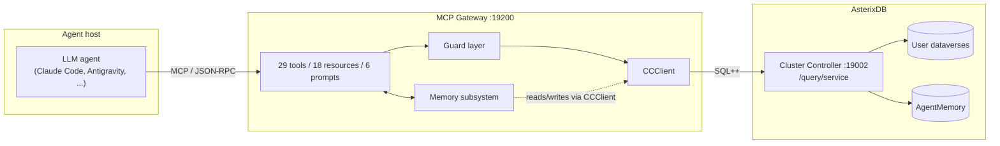
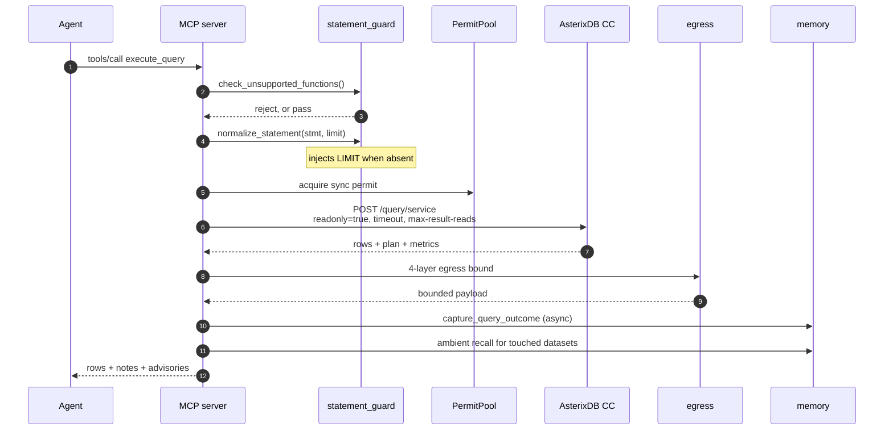
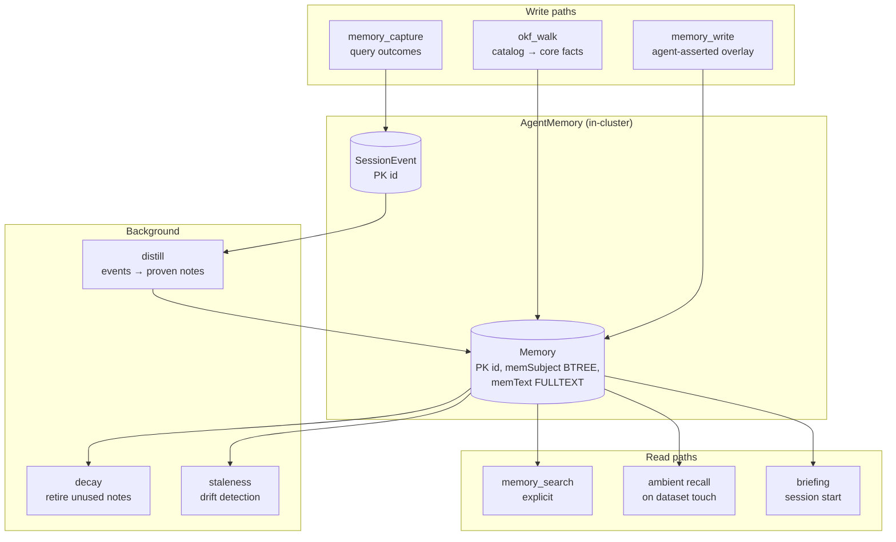
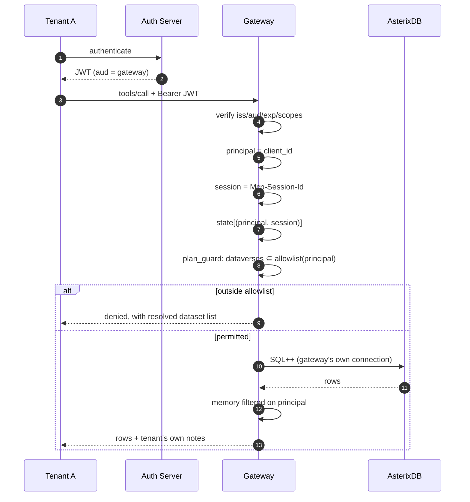
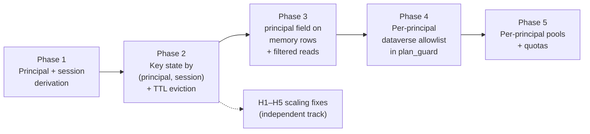

# AsterixDB MCP Gateway — Architecture, Multi-Tenancy, and Token Economics

**Date:** 2026-07-31
**Audience:** AsterixDB dev team
**Purpose:** current state, the multi-tenancy gap, and what we can close without touching engine code.

---

## 1. TL;DR

The gateway is an MCP server that lets an LLM agent query AsterixDB safely. It is
built, tested, and running. Three things are worth the team's time today:

1. **Multi-tenancy is not implemented.** The gateway authenticates callers and then
   discards their identity. Four separate planes are affected, one of which writes
   incorrect data under concurrency.
2. **All four planes can be closed on the gateway side.** The MCP specification's
   own authorization model puts tenancy at the server, not the database. We need
   **no engine changes** for the prototype. We do need one deployment guarantee.
3. **Memory saves tokens, not correctness.** Measured: −29.4% input tokens. The
   saving comes almost entirely from *fewer turns*, not smaller turns. This changes
   what we should optimize next.

Questions for the team are in [§9](#9-open-questions-for-the-team).

---

## 2. What the gateway is

An LLM agent cannot safely be handed a database. It will write unbounded scans,
pull result sets far larger than its context, hallucinate schema, and repeat the
same failed query across sessions.

The gateway sits between them: it exposes AsterixDB as a set of typed MCP tools,
enforces read-only and resource bounds on every statement, bounds every response
to a token budget, and remembers what worked.

| | |
|---|---|
| Language | Python 3.12, `mcp` SDK 2.x |
| Size | 13,261 lines, 75 test modules, 100% coverage gate |
| Surface | 29 tools, 18 resources, 6 prompts |
| Transports | stdio (one process per client), Streamable HTTP (`:19200`) |
| Cluster contact | AsterixDB CC query service, HTTP |

---

## 3. Current architecture

### 3.1 System context



Note the shape that matters later: **memory lives inside the same cluster as the
data it describes.** That is deliberate — it is what lets a stored fact re-derive
itself by re-running its own `source_query`. Bolt-on memory frameworks keep memory
in a separate store and structurally cannot do this.

### 3.2 Request pipeline — `execute_query` end to end



**Egress is four independent layers** — each one alone is insufficient:

| Layer | Where | Bound |
|---|---|---|
| 1 | CC request params | `readonly=true`, statement timeout, max result reads |
| 2 | `enforce_byte_ceiling` | raw HTTP body cap before parsing |
| 3 | `bound_rows_for_llm` | rows + bytes actually shown to the model |
| 4 | `clamp_long_values` | per-field character clamp |

Plus an adaptive tightening: if the plan shows a **columnar full scan**, layers 3–4
drop to `COLUMNAR_FLAGGED_MAX_ROWS = 10` / `16 KiB` (`egress.py:43-49`).

### 3.3 Memory subsystem



Two design properties worth stating explicitly:

- **Core / overlay split.** The catalog walk owns machine-derived `core` facts and
  rewrites them on every re-walk. Agent-learned `overlay` survives re-walks and is
  re-grounded against the new core.
- **Bi-temporal validity.** Rows carry `valid_from` / `valid_to`. Superseding a fact
  re-inserts and retires; it does not delete. `valid_to IS UNKNOWN` selects current
  rows. This is how a corrected fact and the stale one it replaced stay
  distinguishable — and it is why vector similarity cannot do this job (see
  `docs/design/OKF_VECTOR_MEMORY_RESEARCH.md`).

---

## 4. What's new in MCP 2.0, and how we use it

The gateway migrated to SDK 2.x. The relevant changes:

| Change | How we use it |
|---|---|
| **OAuth 2.1 resource-server model** | `auth.py` verifies bearer JWTs against the AS's JWKS: issuer, audience (RFC 8707), expiry, scopes. Gateway never issues or stores tokens. |
| **Per-call `Context` injection** | No ambient `get_context()`. Every tool takes `ctx` explicitly — identity belongs to the *call*, not the process. This is what makes per-tenant state possible at all. |
| **Session ↔ credential binding** | SDK tracks `_session_owners: dict[str, AuthorizationContext]`; a session can only be used by the credential that created it. Cross-tenant session hijacking is blocked at transport level, free. |
| **`session_idle_timeout`** | Idle sessions reaped automatically. **We do not currently set this** — see §7. |
| **`version` in `serverInfo`** | Clients can distinguish gateway builds. |
| **Structured tool output** | Tools return typed structured content alongside text; the model gets a schema, not prose. |
| **Transport security settings** | Host binding + DNS-rebinding allowlist as transport args (`build_transport_security`). |

The specification is also explicit about two anti-patterns we must not adopt:

- **Token passthrough is forbidden.** The gateway must not forward the client's
  token upstream to AsterixDB. It holds its own relationship to the cluster.
- **The confused-deputy problem is named directly.** A server that authenticates a
  caller and then acts with its own higher privilege, without scoping to that
  caller, is the exact failure mode.

The second one is our current state. Which brings us to the gap.

---

## 5. The multi-tenancy gap

### 5.1 Precise statement

The gateway verifies who you are and then throws that away. `grep get_access_token src/ tests/`
returns **zero hits**.

Four planes are affected:

```mermaid
flowchart TB
    subgraph P1["Plane 1 — Identity"]
        I1["auth.py verifies JWT ✓"]
        I2["AccessToken(client_id, scopes) ✓"]
        I3["...never read by any call site ✗"]
        I1 --> I2 --> I3
    end

    subgraph P2["Plane 2 — In-process state"]
        S1["CaptureState, RecallState,<br/>BriefingState, session_id"]
        S2["Documented 'session-scoped'"]
        S3["Actually process-wide singletons ✗"]
        S1 --> S2 --> S3
    end

    subgraph P3["Plane 3 — Memory data"]
        D1["AgentMemory.Memory<br/>PRIMARY KEY id"]
        D2["No principal / tenant field ✗"]
        D1 --> D2
    end

    subgraph P4["Plane 4 — Cluster authorization"]
        A1["cc_client._headers()<br/>= {Accept: application/json}"]
        A2["No credential. Engine has no authz. ✗"]
        A1 --> A2
    end
```



**Plane 2 detail — this one writes wrong data.** `CaptureState._failures` is keyed by
*subject only*. The capture rule is "a failure, then a later success on the same
subject, means the second statement fixed the first." Process-wide, with two
concurrent clients, that pairs **client A's failure with client B's unrelated
success** and persists a note asserting B's query fixes A's error. Automatic, no
model involved, then served to everyone. It is also a cross-tenant information
path: A's statement text lands in a note shown to B.

Two further consequences of the same root cause: only the **first** client ever to
connect receives a briefing, and the **second client onward silently receives no
memory notes at all** — which defeats the memory layer for every client except one,
in the transport we actually deploy.

**Plane 4 detail.** We verified the engine side:

```
grep -rl 'IAuthenticator|Principal|authenticat' --include='*.java' \
  asterixdb/asterix-app/src/main/java asterixdb/asterix-common/src/main/java
→ CloudProperties.java   (S3 storage credentials — unrelated)

grep -rl 'Authorization' --include='*.java' hyracks-http/src/main/java
→ (no matches)
```

AsterixDB has no authentication or authorization subsystem. Every caller reaching
the CC has full cluster privileges.

### 5.2 Why this belongs in the gateway

Not a workaround — it is the specification's intended shape. MCP defines the server
as an OAuth 2.1 **resource server** that holds its own upstream relationship. The
same pattern is standard elsewhere: PgBouncer, Hasura, PostgREST.

It rests on one deployment guarantee:

> **The CC must be reachable only through the gateway.** Bind to loopback or a
> private network; the gateway is the sole ingress.

If that is violated, every control below is decoration. This is a hard requirement,
not a recommendation, and should be documented as such.

### 5.3 Proposed design

Two keys, not one. Conflating them re-breaks things:

| Key | Source | Lifetime | Gates |
|---|---|---|---|
| **principal** (tenant) | `get_access_token().client_id` — verified token only | Spans sessions | Memory rows, dataverse allowlist, quotas |
| **session** | SDK session id | One conversation | Briefing, recall, capture |

Tenant alone re-breaks briefing/recall for the same user's second conversation.
Session alone leaves memory rows shared across tenants.

**Client-supplied headers are never an identity assertion.** The SDK's own docstring
says so. `Mcp-Session-Id` keys state; it never grants authorization.



**Enforce scope in `plan_guard`, not `statement_guard`.** `plan_guard` sees the
datasets the compiled plan *actually* touches, so views, subqueries, and synonyms
cannot smuggle past a regex on statement text.

### 5.4 What the SDK does *not* give us

Two items we own:

1. **No session-end callback.** The SDK reaps its own transport and forgets. Our
   per-session state would accumulate forever. Keying by session is not enough —
   we must add TTL/LRU eviction, or C1–C4 become a memory leak instead of a
   correctness bug.
2. **`session_idle_timeout` is unset.** Our `streamable_http_app()` call passes
   host, path, and transport security — no idle timeout. Default is `None` = never
   reaped. SDK docs recommend `1800`.

---

## 6. Token economics

### 6.1 Measured

Real per-turn token counts, memory-on vs memory-off, identical task sets:

| Metric | Result |
|---|---|
| Input tokens | **−29.4%** (4.30M / 67 turns vs 6.09M / 73 turns) |
| Share of input that is cache-read | 93% |
| Uncached input per turn | only −6% |
| Correctness (Set B) | **10/10 in all three arms** |
| Break-even | ~1.3 sessions |

### 6.2 The conclusion that matters

**Memory sells tokens, not correctness.** Both memory arms and the control arm
scored identically on correctness; both SQL errors observed came *from* memory arms.
We should stop claiming accuracy gains — the honest pitch is cost.

**And the saving is turn elimination, not turn compression.** Per-turn input barely
moved (−6% uncached). Input cost is roughly

```
input ≈ turns × accumulated_context
```

which is superlinear in turns. Removing a turn removes that turn *and* its
contribution to every later turn's context. That is the only superlinear lever we
have — everything else is a constant factor.

### 6.3 Where the remaining budget goes

The 29 tool schemas cost **~12.9k tokens per turn**, roughly **20% of input**, paid
on every single turn whether or not any tool is used.

Ranked levers, with honesty about status:

| Lever | Effect | Status |
|---|---|---|
| Turn elimination via memory | superlinear | **measured, shipped** |
| Tool schema tax reduction | ~20% of input, constant | **proposed** |
| Egress caps (rows/bytes/fields) | bounds worst case | **shipped** |
| Cache alignment (stable prefix) | protects the 93% | **shipped** |
| Structured output vs prose | modest | **shipped** |

The tool-schema item is the largest untouched block. Options: fewer, broader tools;
or progressive disclosure so full schemas load only when a domain is entered.

### 6.4 What we explicitly rejected

Vector/VTree retrieval for the memory layer. A stale fact and its correction are
semantically near-identical — "median listing price is 410.0" vs "290.0" differs by
one numeric token out of six — so cosine similarity ranks them interchangeable. The
distinguishing property is *temporal validity*, which embeddings do not encode.
Published results agree: dense retrieval measurably *degrades* staleness handling
without temporal constraints. Full argument and citations in
`docs/design/OKF_VECTOR_MEMORY_RESEARCH.md`.

---

## 7. Production-readiness findings

Full detail in `docs/PRODUCTION_READINESS_FINDINGS.md`. **Nothing here is broken in
the current single-user deployment** — every item opens under production conditions.

| ID | Finding | Impact |
|---|---|---|
| C1 | Only first client receives briefing | silent feature loss |
| C2 | Second client onward gets no memory notes | memory layer defeated |
| **C3** | **Cross-client fabricated "fix" notes** | **writes false data** |
| C4 | "Distinct sessions" counts gateway restarts | weak corroboration |
| H1 | Distillation full-scans entire event log into RAM | OOM at scale |
| H2 | `SessionEvent` has no retention | unbounded growth |
| H3 | Event statements stored untrimmed | ~500 MB/day at 10⁶ q/day |
| H4 | Offline JSONL buffer has no size cap | disk-full → gateway down |
| H5 | `RecallState._rows` never evicts | slow leak |
| M1 | Sync file I/O in async request paths | event-loop stalls |
| M2 | Buffer replay runs inline on a user query | first query after outage absorbs backlog |
| M3 | `decay` scans all notes, unlimited | same shape as H1 |

**Not yet audited:** `permits.py`, `http_security.py`, `egress.py`,
`statement_guard.py`, `plan_guard.py`, and the in-engine Java `okf_catalog()` path.

H2's fix is structural rather than a retention policy: roll events up to a counter
per `(subject, statement_hash, outcome)`. Cardinality then bounds to *distinct query
shapes* — thousands, not millions — and distillation only ever wanted aggregates.

---

## 8. Plan — what we can achieve without engine changes



| Phase | Closes | Engine change | Note |
|---|---|---|---|
| 1 | foundation | none | `_principal(ctx)`, `_session_key(ctx)` |
| 2 | C1, C2, **C3**, C4 | none | + `session_idle_timeout=1800` |
| 3 | Plane 3 | none | **changes stored data — needs migration; do before production data exists** |
| 4 | Plane 4 (policy) | none | enforced on compiled plan |
| 5 | noisy neighbor | none | |

**Every phase is gateway-side.** The full end-to-end multi-tenant prototype is
achievable with zero engine changes.

### What we can demonstrate

1. Two OAuth tokens, tenants A and B, real JWT verification
2. A writes a memory note → B queries the same subject → **B does not see it**
3. B queries a dataverse outside its allowlist → denied at `plan_guard`, with the
   resolved dataset list shown
4. Both tenants concurrent → briefing, recall, and capture correct for each
5. Measured token delta preserved per tenant

### 8.1 What Phases 4–5 need from the engine

**Nothing is required.** The machinery is already shipped and in use:

| Piece | Where |
|---|---|
| Compile without executing | `cc_client.compile_query()` — `compile-only=true` |
| Optimized plan as JSON operator tree | `plans.optimizedLogicalPlan` |
| Plan → `(dataverse, dataset)` pairs | `plan_parser.datasets_from_sources()` |
| Existing consumer of the same path | `plan_guard.check_columnar_scan()` |

Phase 4 flow: compile-only → parse plan → extract dataset set → check allowlist →
deny **before** execution.

This is also why enforcement belongs on the plan rather than the statement text: the
optimized plan is *post-resolution*, so synonyms, views, and inlined UDF bodies
appear as the base datasets they actually read. A regex over statement text sees
none of that.

Phase 5 needs no engine change for gateway-level fairness. Per-principal
`PermitPool` semaphores handle concurrency, and load can be shaped with knobs
already wired in `compiler_params.py` — `compiler.parallelism` and the per-operator
memory budgets (sort/join/group/window, 512 KiB floor, 2 GiB cap). A lower-tier
tenant gets reduced parallelism and smaller budgets. `cancel_query` enforces a
wall-clock budget.

**Three caveats to handle in our own code before Phase 4 lands:**

1. `datasets_from_sources()` currently **fails open** — see finding H6 in
   `PRODUCTION_READINESS_FINDINGS.md`. Authorization must fail closed.
2. Compile-then-execute means the statement is compiled twice; we authorize the
   plan from call 1 and the engine executes a fresh compile in call 2. Low risk
   (same text, metadata rarely moves mid-flight), but it is an assumption, not a
   guarantee.
3. Non-query statements have no plan; they are covered by `readonly=true`, which
   means we trust the engine to honor that flag. Pre-existing reliance, but it
   becomes load-bearing for tenancy.

**What genuinely needs the engine — neither required, both large:**

| Gap | Why it needs the engine |
|---|---|
| Per-principal authorization | Defense-in-depth if the CC is reachable directly |
| Workload management / admission control | Gateway permits bound requests *through the gateway*; they cannot stop one tenant's single expensive query from consuming cluster memory and I/O |

Both are permanent public APIs and community architecture decisions.

### What remains genuinely engine-side

**Defense in depth only.** If the CC is directly reachable, gateway policy is
bypassed. Closing that needs engine-level authorization — a permanent public API
and a community architecture decision, not something to prototype solo. We propose
raising it as a scoped design question *backed by* the working prototype, rather
than as an unsolicited patch.

---

## 9. Open questions for the team

1. **Is the gateway an accepted policy enforcement point** for AsterixDB
   deployments — i.e. is "CC reachable only via gateway" a deployment contract the
   project is willing to document? This determines whether Phases 4–5 are the right
   answer or a stopgap.
2. **Is engine-level authorization on any roadmap?** If yes, we should align the
   gateway's principal model to it now rather than build a second one.
3. **Tenancy granularity:** is a tenant an OAuth `client_id`, an end user (`sub`),
   or an org claim? Phase 3 ships `client_id`, because it is the claim every
   verified token carries. Changing it later is a one-line change in identity
   resolution plus a re-run of the ownership backfill, not a schema change.
4. **Memory store placement:** one shared `AgentMemory` dataverse with a principal
   filter, or one dataverse per tenant? Per-tenant gives stronger isolation;
   shared gives cross-tenant distillation of genuinely general facts. Phase 3
   ships the shared form, with a single accessor module as the only place that
   names the datasets — so moving to a dataverse per tenant stays mechanical.
5. **Is the token result (cost, not correctness) the right thing to optimize** for
   the project's goals? If yes, the tool-schema tax is the next largest lever and
   worth a design pass.

---

## 10. Verification index

Every claim above is checkable:

| Claim | Where |
|---|---|
| State objects are process singletons | `server.py:606-610` |
| "Session-scoped" docstrings | `tools/memory_notes.py:255`, `tools/briefing.py:40` |
| Capture keyed by subject only | `tools/memory_capture.py:62-80` |
| Session id is per-process | `config.py:310` |
| Identity never consumed | `grep get_access_token src/ tests/` → 0 hits |
| No cluster credential | `cc_client.py` `_headers()` |
| Unbounded distill scan | `distill.py:46` |
| Memory schema, no principal | `okf_walk.py:41-48` |
| SDK session↔credential binding | `mcp/server/streamable_http_manager.py:107-110` |
| `session_idle_timeout` unset | `http_app.py:181` |
| Engine has no auth surface | grep commands in §5.1 |
| Columnar egress tightening | `egress.py:43-49` |
